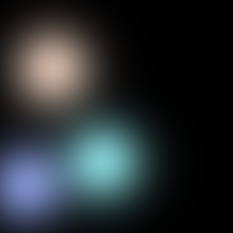

# Gaussian Splatting 2D
This is a demo of 2d gaussian generating image.
## Features
1. Pre-generate coordinates for drawing gaussian image rather than using grid sample.
2. Speedup training time by using less initialization sample points and increase the number gradually.
3. Use tanh to parse parameters which gives larger gradient at the beginning of training.
4. Less code, easier to understand.
## Usage

```cmd
python run.py
```

With 3000 sample points, you should have at least 16GB gpu memory.
The code only uses L1 loss for supervision. It will be better using other losses.

**Example of 3 random gaussian**



**Result of 10 epoch(about 10 minutes on my GPU)**


## Reference
[Gaussian Splatting](https://github.com/graphdeco-inria/gaussian-splatting)

[2D-Gaussian-Splatting](https://github.com/OutofAi/2D-Gaussian-Splatting)
